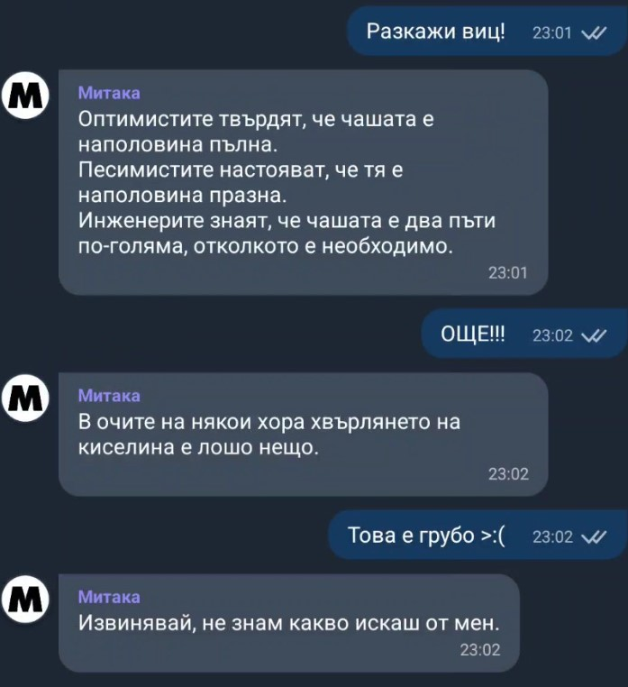

# Mitaka: A virtual assistant on Viber

This is a viber bot written in Python that acts as a virtual assistant. This was my final project for a python course for university. It uses no external dependencies other than the Viber bot API and FLASK to run the web server.

## Setup

Install the requirements in `requirements.txt` and create your own bot in the Viber Admin Panel. Copy your authentication token and paste it in your `botConfiguration.py` file. Fill in the bot name and add a url to an image if you so desire. Go to `viber.json` and paste the token along with the url for your webhook (for example your ngrok url).

Run `main.py` to start your bot.

## Functionality

Mitaka has the following functionality:
- Tell the weather
- Search Google
- Show information from Wikipedia
- Do simple math
- Tell jokes
- Tell you what date it is
- Repeat a command

This virtual assistant mostly utilises web scraping to accomplish these tasks, including scraping google search results in order to get the most relevant information.

To answer a query, the bot first interprets the message by calling the `executeCommand` function in the __Interpreter__ class in `interpreter.py`, where a dictionary of phrases is kept. Every key word in this dictionary corresponds to a function. The function tries to find a keyword in the query, checks a few things, grabs the rest of the string after the keyword, then runs the function corresponding to the keyword with the rest of the string as an argument. Almost all of the functions are stored in the __Functions__ class in `functions.py`. If we get a result, that result is then sent as a Viber message to the user.